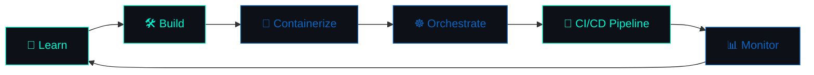

<div align="center">


[](https://git.io/typing-svg)

<p>
  
  
  
</p>

<a href="https://www.linkedin.com/in/yuvaraj-devops/"></a>
<a href="https://www.instagram.com/_yvrxj._/"></a>
<a href="mailto:yuviyuvaraj7639@gmail.com"></a>

</div>

<br/>

```yaml
# whoami.yaml
apiVersion: v1
kind: Engineer
metadata:
  name: yuvaraj
  labels:
    role: cloud-devops-engineer
    status: aspiring-and-hungry
spec:
  stack:
    cloud: [AWS]
    containers: [Docker, Kubernetes]
    iac: [Terraform]
    cicd: [Jenkins, GitHub-Actions]
    observability: [Prometheus, Grafana, CloudWatch]
    os: [Linux]
    scripting: [Bash]
  currentlyLearning: [GitHub Actions, Automation-at-scale]
  goal: "land a Cloud/DevOps Engineer role"
  motto: "Automate, Optimize & Deploy"
```

<br/>

<div align="center">

### 🛰️ Deployment Pipeline

</div>



<br/>

### 🎓 Education Journey

<table>
<tr><td>📍</td><td><b>Cloud & DevOps Training</b> — Besant Technologies, Chennai <i>(Present)</i></td></tr>
<tr><td>🎓</td><td><b>B.Sc. Computer Science</b> — Aadhavan College of Arts & Science, Trichy <i>(2022–2025)</i></td></tr>
<tr><td>🏫</td><td><b>Computer Science Stream</b> — Karur Saraswathi Vidyalaya HSS <i>(2020–2022)</i></td></tr>
</table>

<br/>

<div align="center">

### 🛠️ Tech Stack

**☁️ Cloud / Infra**


**🐳 Containers & Orchestration**


**🏗️ Infrastructure as Code**


**🔄 CI/CD**


**📊 Monitoring & Observability**


**🖥️ OS, Scripting & VCS**


</div>

<br/>

<div align="center">

### 📶 Skill Progress

</div>

```text
AWS            ████████████░░░░░░░░  60%
Docker         ██████████████░░░░░░  70%
Kubernetes     ██████████░░░░░░░░░░  50%
Terraform      ████████░░░░░░░░░░░░  40%
CI/CD          ████████████░░░░░░░░  60%
Linux & Bash   ████████████████░░░░  80%
```
<div align="center"><sub>self-rated — tune the bars as you level up ⚡</sub></div>

<br/>

### 📊 GitHub Vibes

<p align="center">
  
  
</p>

<p align="center">
  
</p>

<p align="center">
  
</p>

<div align="center">

### 🐍 Contribution Snake


<sub>Appears automatically once the workflow in <code>snake-workflow.yml</code> (shared alongside this README) runs on your profile repo — see setup note at the end.</sub>

</div>

<br/>

<div align="center">

### 📈 GitHub Profile Insights


</div>

<br/>

<div align="center">

### 📬 Let's Connect & Build Something

<a href="https://www.linkedin.com/in/yuvaraj-devops/"></a>
<a href="https://www.instagram.com/_yvrxj._/"></a>
<a href="mailto:yuviyuvaraj7639@gmail.com"></a>

<br/><br/>

✨ *"Automating the boring, securing the critical, and building with purpose."*


</div>
